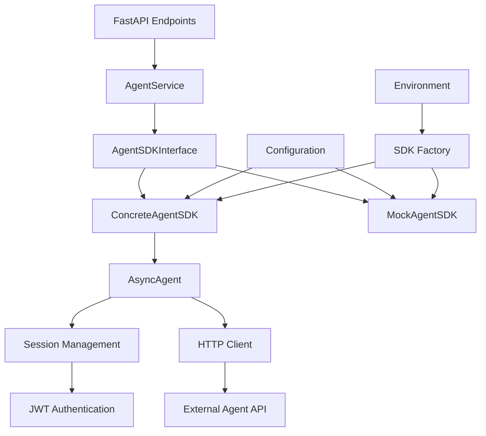

# Design Document

## Overview

This design document outlines the implementation of a concrete Agent SDK that replaces the current mock implementation with a more realistic version based on the actual Agent SDK structure. The new implementation will support JWT authentication, session management, and proper API integration while maintaining backward compatibility with existing interfaces.

The design follows the existing FastAPI patterns and maintains the current AgentSDKInterface contract to ensure seamless integration with existing services.

## Architecture

### High-Level Architecture



### Component Relationships

1. **AgentService** continues to use the AgentSDKInterface abstraction
2. **SDK Factory** determines which implementation to use based on configuration
3. **ConcreteAgentSDK** implements the real agent service integration
4. **MockAgentSDK** remains available for development and testing
5. **AsyncAgent** handles the low-level agent operations and session management

## Components and Interfaces

### 1. Enhanced AgentSDKInterface

The existing interface remains unchanged to maintain backward compatibility:

```python
class AgentSDKInterface(ABC):
    @abstractmethod
    async def get_agent(self, agent_id: str) -> Dict[str, Any]:
        """Retrieve agent information from the SDK."""
        pass
```

### 2. ConcreteAgentSDK Implementation

New concrete implementation that integrates with the real agent service:

```python
class ConcreteAgentSDK(AgentSDKInterface):
    def __init__(self, config: AgentSDKConfig):
        self.config = config
        self.session_manager = SessionManager(config.jwt_token)
        self.http_client = HttpAsyncClient()
    
    async def get_agent(self, agent_id: str) -> Dict[str, Any]:
        """Retrieve agent using AsyncAgent and transform response."""
        pass
```

### 3. AsyncAgent Class

Core agent class based on the SDK documentation:

```python
class AsyncAgent(BaseModel):
    # Core identification
    agent_id: Optional[str] = None
    agent_name: Optional[str] = Field(default_factory=lambda: f"Agent: {random.randint(1000, 9999)}")
    
    # Environment and connection
    env: Optional[str] = None
    base_url: Optional[str] = None
    session: Optional[Session] = None
    
    # Configuration
    request_timeout: Optional[int] = 180
    auth_headers: Optional[Dict] = None
    llm_model: Optional[str] = None
    
    # Additional properties from SDK
    agent_description: Optional[str] = ""
    prompt: Optional[str] = ""
    role: Optional[str] = ""
    welcome_message: Optional[str] = "Hi! How can I assist you today?"
    
    async def view(self, agent_id: Optional[str] = None) -> Dict[str, Any]:
        """View agent details via API call."""
        pass
```

### 4. Session Management

Handles JWT authentication and session lifecycle:

```python
class SessionManager:
    def __init__(self, jwt_token: str):
        self.jwt_token = jwt_token
        self.session: Optional[Session] = None
    
    async def ensure_session(self) -> Session:
        """Ensure active session exists."""
        pass
    
    def validate_token(self) -> bool:
        """Validate JWT token format and expiration."""
        pass
```

### 5. AgentHelper Integration

Bridge class that follows the SDK patterns:

```python
class AgentHelper:
    def __init__(self, env: str, agent_id: str, jwt_token: str, **kwargs):
        self.env = env.upper()
        self.agent_id = agent_id
        self.jwt_token = jwt_token
        # Handle optional parameters
    
    def set_session(self):
        """Initialize session with JWT token."""
        pass
    
    async def get_agent(self) -> AsyncAgent:
        """Create and configure AsyncAgent instance."""
        pass
```

### 6. SDK Factory

Determines which SDK implementation to use:

```python
class AgentSDKFactory:
    @staticmethod
    def create_sdk(config: Settings) -> AgentSDKInterface:
        """Create appropriate SDK implementation based on configuration."""
        if config.ENV.lower() in ['local', 'test'] or config.DEBUG:
            return MockAgentSDK()
        else:
            return ConcreteAgentSDK(AgentSDKConfig.from_settings(config))
```

## Data Models

### Configuration Model

```python
class AgentSDKConfig(BaseModel):
    env: str
    base_url: str
    jwt_token: Optional[str] = None
    request_timeout: int = 180
    retry_count: int = 3
    mock_mode: bool = False
    
    @classmethod
    def from_settings(cls, settings: Settings) -> 'AgentSDKConfig':
        """Create config from application settings."""
        pass
```

### Agent Response Model

The response format matches the documented JSON structure:

```python
class AgentDetailsResponse(BaseModel):
    agentId: str
    agentName: str
    orgId: str = ""
    tenantId: str
    agentConfig: AgentConfig
    
class AgentConfig(BaseModel):
    version: str
    ownerId: str
    agentType: str = "BYOD"
    group: str = "Personal"
    requestUrl: str
    rootUrl: str
    llmModel: str
    status: str
    retrieverStrategy: str
    reasoningAlgorithm: str
    # ... additional fields from SDK response
```

### Response Transformation

Transform the detailed agent response to the simple format expected by existing code:

```python
def transform_agent_response(agent_details: AgentDetailsResponse) -> Dict[str, Any]:
    """Transform detailed agent response to simple format."""
    return {
        "id": agent_details.agentId,
        "name": agent_details.agentName,
        "status": agent_details.agentConfig.status.lower()
    }
```

## Error Handling

### Exception Hierarchy

```python
class AgentSDKError(Exception):
    """Base exception for Agent SDK errors."""
    pass

class AuthenticationError(AgentSDKError):
    """JWT authentication failed."""
    pass

class SessionError(AgentSDKError):
    """Session management error."""
    pass

class AgentAccessError(AgentSDKError):
    """Agent access restricted."""
    pass
```

### Error Mapping

Map SDK-specific errors to existing exception types:

- `AuthenticationError` → `SDKError`
- `SessionError` → `SDKError`
- `AgentAccessError` → `AgentNotFoundError`
- `HTTP 404` → `AgentNotFoundError`
- `HTTP 403` → `AgentNotFoundError` (with access scope message)
- `Timeout` → `SDKTimeoutError`

## Testing Strategy

### Unit Tests

1. **AsyncAgent Tests**
   - Initialization with various parameter combinations
   - Session management and JWT validation
   - API call methods and response handling
   - Error scenarios and exception handling

2. **ConcreteAgentSDK Tests**
   - Integration with AsyncAgent
   - Response transformation
   - Error handling and retry logic
   - Configuration validation

3. **SessionManager Tests**
   - JWT token validation
   - Session lifecycle management
   - Authentication error handling

### Integration Tests

1. **End-to-End Flow Tests**
   - Complete request flow from API to SDK
   - Authentication and authorization scenarios
   - Error propagation through the stack

2. **Mock vs Real SDK Tests**
   - Verify both implementations return compatible data
   - Test switching between implementations
   - Validate configuration-based selection

### Test Configuration

```python
# Test settings for different scenarios
TEST_CONFIGS = {
    'mock_mode': {
        'ENV': 'test',
        'DEBUG': True,
        'AGENT_SDK_MOCK_MODE': True
    },
    'real_mode': {
        'ENV': 'dev',
        'DEBUG': False,
        'AGENT_SDK_JWT_TOKEN': 'test-jwt-token',
        'AGENT_SDK_BASE_URL': 'https://test-api.example.com'
    }
}
```

## Configuration Management

### Environment Variables

```bash
# Agent SDK Configuration
AGENT_SDK_ENV=DEV
AGENT_SDK_BASE_URL=https://lm.qa.example.net
AGENT_SDK_JWT_TOKEN=your-jwt-token-here
AGENT_SDK_TIMEOUT=180
AGENT_SDK_RETRY_COUNT=3
AGENT_SDK_MOCK_MODE=false
```

### Settings Integration

Extend the existing Settings class:

```python
class Settings(BaseSettings):
    # ... existing settings ...
    
    # Enhanced Agent SDK Configuration
    AGENT_SDK_ENV: str = Field("DEV", description="Agent SDK environment")
    AGENT_SDK_BASE_URL: str = Field("https://lm.qa.example.net", description="Agent SDK base URL")
    AGENT_SDK_JWT_TOKEN: Optional[str] = Field(None, description="JWT token for agent authentication")
    AGENT_SDK_MOCK_MODE: bool = Field(False, description="Force mock mode even in production")
```

## Implementation Phases

### Phase 1: Core Infrastructure
- Implement AsyncAgent class with basic functionality
- Create SessionManager for JWT handling
- Set up configuration management
- Implement SDK factory pattern

### Phase 2: API Integration
- Implement ConcreteAgentSDK with real API calls
- Add response transformation logic
- Implement error handling and retry logic
- Update dependency injection

### Phase 3: Testing and Validation
- Comprehensive unit test suite
- Integration tests with mock and real modes
- Performance testing and optimization
- Documentation updates

### Phase 4: Production Readiness
- Security review of JWT handling
- Performance monitoring integration
- Production configuration validation
- Deployment and rollback procedures

## Security Considerations

### JWT Token Handling
- Store JWT tokens securely in environment variables
- Validate token format and expiration
- Implement token refresh mechanism if needed
- Log authentication failures without exposing tokens

### API Security
- Use HTTPS for all external API calls
- Validate SSL certificates
- Implement request signing if required
- Rate limiting and circuit breaker patterns

### Error Information
- Sanitize error messages to avoid information leakage
- Log detailed errors server-side only
- Return generic error messages to clients
- Implement proper audit logging

## Performance Considerations

### Connection Management
- Reuse HTTP connections where possible
- Implement connection pooling
- Set appropriate timeouts
- Monitor connection health

### Caching Strategy
- Cache agent details for short periods
- Implement cache invalidation
- Use appropriate cache keys
- Monitor cache hit rates

### Monitoring and Observability
- Add structured logging for all SDK operations
- Implement metrics for success/failure rates
- Monitor response times and timeouts
- Set up alerts for error thresholds