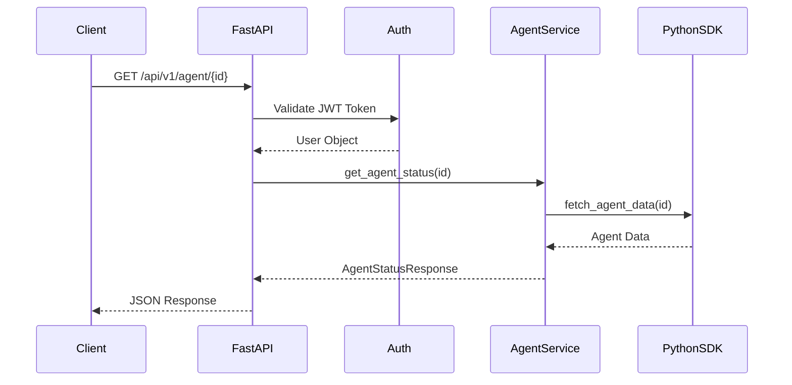

# Design Document

## Overview

The Agent Status API provides a RESTful endpoint for retrieving AI agent status information. This endpoint acts as a proxy layer between HTTP clients and a Python SDK, handling authentication, validation, error handling, and response formatting while maintaining consistency with existing FastAPI patterns.

## Architecture

### High-Level Flow



### Component Integration

The endpoint integrates with existing FastAPI infrastructure:
- Uses existing authentication dependencies from `api/deps.py`
- Follows router organization pattern under `/api/v1/`
- Leverages Pydantic models for validation
- Uses structured logging from `core/logging.py`

## Components and Interfaces

### 1. Router Module (`api/routes/v1/agents.py`)

**Purpose**: HTTP endpoint definition and request handling
**Dependencies**: 
- Authentication dependencies from `api/deps.py`
- Agent service for business logic
- Pydantic models for validation

**Key Functions**:
- `get_agent_status(agent_id: str, user: User)` - Main endpoint handler
### 2. S
ervice Layer (`services/agent_service.py`)

**Purpose**: Business logic and Python SDK integration
**Responsibilities**:
- Validate agent ID format
- Interface with Python SDK
- Handle SDK errors and timeouts
- Transform SDK responses to API models

**Key Functions**:
- `get_agent_status(agent_id: str) -> AgentStatusResponse`
- `_validate_agent_id(agent_id: str) -> bool`
- `_handle_sdk_error(error: Exception) -> HTTPException`

### 3. Python SDK Interface

**Purpose**: Abstract interface for the Python SDK (to be provided later)
**Expected Interface**:
```python
class AgentSDK:
    def get_agent(self, agent_id: str) -> dict
    # Returns: {"id": str, "name": str, "status": str, ...}
```

### 4. Configuration Extension

**Purpose**: SDK-related configuration settings
**New Settings**:
- `AGENT_SDK_TIMEOUT: int = 30` - SDK call timeout in seconds
- `AGENT_SDK_RETRY_COUNT: int = 3` - Number of retry attempts

## Data Models

### Request Models

**Path Parameters**:
- `agent_id: str` - Agent identifier (validated via path parameter)

**No request body required for GET endpoint**

### Response Models

#### AgentStatusResponse
```python
class AgentStatusResponse(BaseModel):
    id: str = Field(..., description="Agent unique identifier")
    agent_name: str = Field(..., description="Human-readable agent name")
    status: str = Field(..., description="Current agent status")
    
    class Config:
        json_schema_extra = {
            "example": {
                "id": "agent-123",
                "agent_name": "Customer Support Bot",
                "status": "active"
            }
        }
```

#### Error Response Models
```python
class ErrorDetail(BaseModel):
    message: str
    code: str
    details: Optional[dict] = None

class ErrorResponse(BaseModel):
    error: ErrorDetail
```## Err
or Handling

### Error Categories and HTTP Status Codes

1. **Authentication Errors (401)**
   - Invalid or missing JWT token
   - Expired token

2. **Authorization Errors (403)**
   - Insufficient permissions/roles

3. **Validation Errors (422)**
   - Invalid agent ID format
   - Malformed request

4. **Not Found Errors (404)**
   - Agent ID does not exist

5. **SDK Integration Errors (502)**
   - Python SDK unavailable
   - SDK timeout
   - Unexpected SDK response format

6. **Internal Server Errors (500)**
   - Unexpected application errors

### Error Response Format

All errors follow a consistent structure:
```json
{
  "error": {
    "message": "Human-readable error message",
    "code": "ERROR_CODE",
    "details": {
      "additional": "context"
    }
  }
}
```

### Logging Strategy

**Request Logging**:
- Log all incoming requests with agent_id, user info, and timestamp
- Use structured logging with consistent field names

**Error Logging**:
- Log SDK errors with full context (agent_id, error details, retry attempts)
- Log authentication/authorization failures for security monitoring

**Response Logging**:
- Log successful responses with response time metrics
- Log error responses with error codes and context

## Testing Strategy

### Unit Tests

1. **Router Tests** (`test_agent_routes.py`)
   - Test endpoint with valid authentication
   - Test authentication failure scenarios
   - Test authorization failure scenarios
   - Test invalid agent ID formats

2. **Service Layer Tests** (`test_agent_service.py`)
   - Test successful SDK integration
   - Test SDK error handling
   - Test timeout scenarios
   - Test response transformation

3. **Model Tests** (`test_agent_models.py`)
   - Test Pydantic model validation
   - Test serialization/deserialization
   - Test error model structures### Integra
tion Tests

1. **End-to-End Tests** (`test_agent_integration.py`)
   - Test complete request flow with mocked SDK
   - Test error propagation from SDK to HTTP response
   - Test authentication integration
   - Test logging integration

### Test Fixtures and Mocks

**SDK Mock**:
```python
@pytest.fixture
def mock_agent_sdk():
    with patch('app.services.agent_service.AgentSDK') as mock:
        yield mock

@pytest.fixture
def sample_agent_data():
    return {
        "id": "test-agent-123",
        "name": "Test Agent",
        "status": "active"
    }
```

**Authentication Fixtures**:
- Valid JWT tokens for different user roles
- Invalid/expired token scenarios
- User objects with various permission levels

## Implementation Considerations

### Security

1. **Input Validation**
   - Validate agent ID format to prevent injection attacks
   - Sanitize all inputs before passing to SDK

2. **Authentication Integration**
   - Use existing JWT authentication system
   - Respect existing role-based authorization patterns

3. **Error Information Disclosure**
   - Avoid exposing internal SDK details in error responses
   - Log sensitive information securely without exposing to clients

### Performance

1. **SDK Integration**
   - Implement timeout handling for SDK calls
   - Consider connection pooling if SDK supports it
   - Implement retry logic with exponential backoff

2. **Caching Considerations**
   - Agent status may change frequently, so caching should be minimal
   - Consider short-term caching (5-10 seconds) for high-traffic scenarios

### Monitoring and Observability

1. **Metrics**
   - Response time distribution
   - Error rate by error type
   - SDK call success/failure rates

2. **Structured Logging Fields**
   - `agent_id`: Agent identifier
   - `user_id`: Authenticated user
   - `request_id`: Unique request identifier
   - `sdk_response_time`: SDK call duration
   - `error_code`: Standardized error codes

### Future Extensibility

The design allows for future enhancements:
- Additional agent metadata fields in response
- Caching layer integration
- Rate limiting per user/agent
- Agent status change notifications
- Batch agent status retrieval